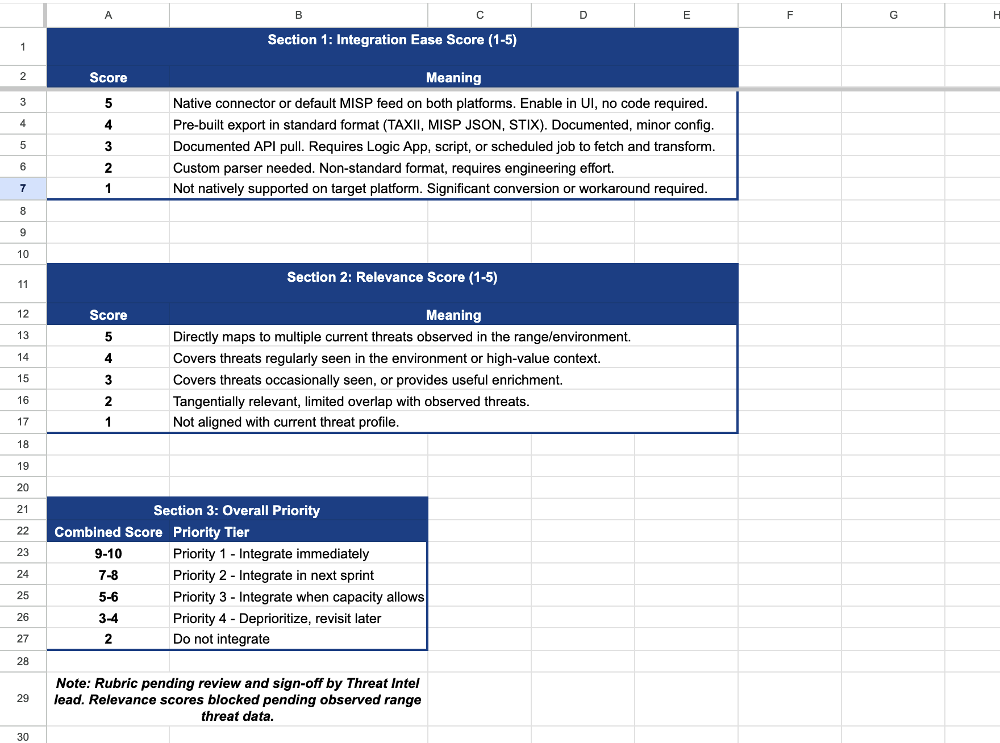
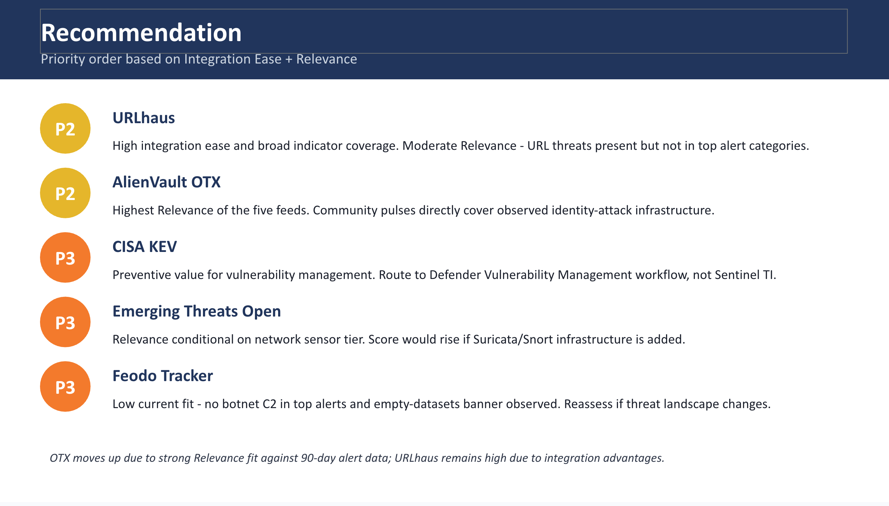

# External Threat Intel Feed Evaluation

Evaluation of five free public threat intelligence feeds against consistent 
criteria, with data-backed prioritization for SOC integration.

## Project Overview

Free public threat intelligence feeds offer coverage across malware 
infrastructure, botnet C2, exploited vulnerabilities, and detection rules 
at no licensing cost. This project evaluated five candidate feeds and 
delivered a prioritized integration recommendation.

## Feeds Evaluated

- Abuse.ch URLhaus
- Abuse.ch Feodo Tracker
- AlienVault OTX (LevelBlue)
- Emerging Threats Open
- CISA Known Exploited Vulnerabilities

## Evaluation Criteria

- Indicator types provided
- Update frequency
- Integration ease (MISP and Microsoft Sentinel)
- Relevance to observed threat profile
- Licensing and TLP handling

## Methodology

Each feed was scored on Integration Ease (1-5) based on documented 
integration paths, and Relevance (1-5) based on 90 days of observed 
SIEM alert data. Combined scores mapped to priority tiers per the 
scoring rubric.

## Key Findings

- AlienVault OTX scored highest on Relevance because community pulses 
  directly cover credential-attack infrastructure, which dominated the 
  observed threat profile.
- URLhaus scored highest on Integration Ease due to native TAXII, 
  pre-built MISP JSON exports, and Suricata rule availability.
- Emerging Threats Open has limited Sentinel value without a network 
  sensor tier because it delivers Suricata/Snort rules rather than 
  raw indicators.
- CISA KEV is more appropriate for vulnerability management than SIEM 
  threat intelligence, and was recommended for routing accordingly.
- Feodo Tracker showed low fit with the observed environment and was 
  observed with an "empty datasets" banner during research; 
  reassessment recommended if the threat landscape shifts.

## Deliverables

- [Evaluation Matrix (Excel)](deliverables/evaluation-matrix.xlsx)
- [Presentation (PowerPoint)](deliverables/presentation.pptx)

## Screenshots

## Skills Demonstrated

- Threat intelligence feed evaluation
- MISP and Microsoft Sentinel integration analysis
- KQL query development for alert data analysis
- Evaluation matrix design and scoring rubric development
- Analyst-grade deliverable production (matrix + presentation)

## Author

**Mohamed Yagoub**  
[LinkedIn](https://linkedin.com/in/mohamed-yagoub/) | 
[GitHub](https://github.com/goubx)
